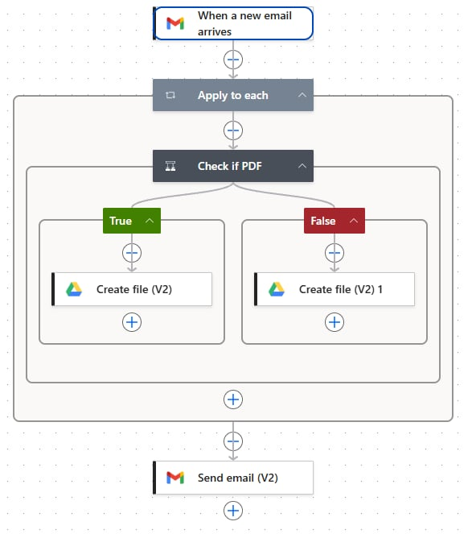
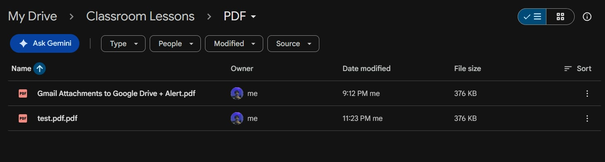

Low-Code/No-Code Automation (Power Automate)

Course: 2627_1SEM-SIA1

 Flow 1: Gmail Attachments to Google Drive + Alert
Triggers when a Gmail message with an attachment arrives. It loops through each
attachment, checks if it is a PDF, saves it to the matching Google Drive folder,
then sends an alert email.

